# How to use central vault in Smart Systems Hub Manufacturing-X Learn & Explore Environment

## Accept GitHub Invitation

- Customer will get email invitation on provided GitHub user email address.
- From their user have to accept the invitation.
- Then customer's GitHub user name will be added to Smart Systems Hub GitHub user account.

## Generate token in GitHub

- Firstly, user have to go to his/her GitHub user settings [GitHub Settings](https://github.com/settings/profile)

  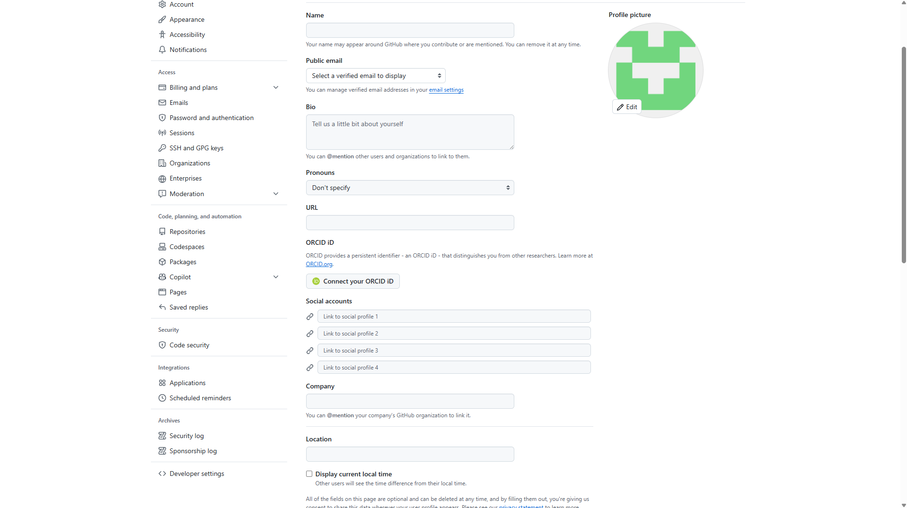

- Now user have to go to Developer settings. Then inside developer settings user have to go to Personal access tokens.

  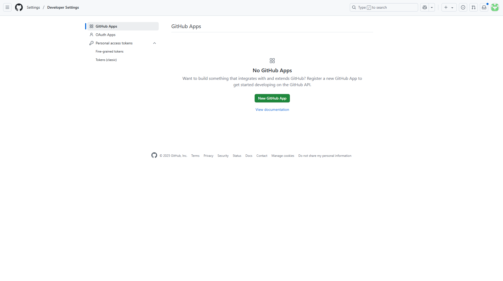

- Then user have to select Tokens (classic), and then click on generate new token.

  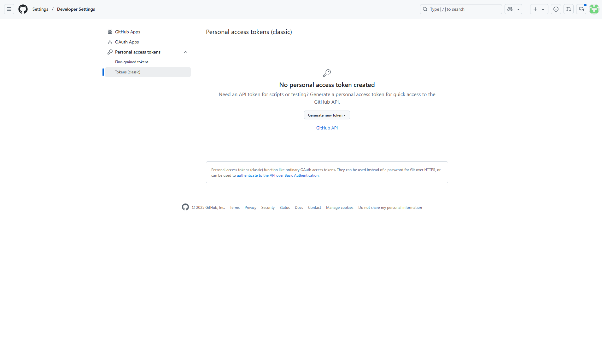

- From select scopes user have to select these scopes:
  
  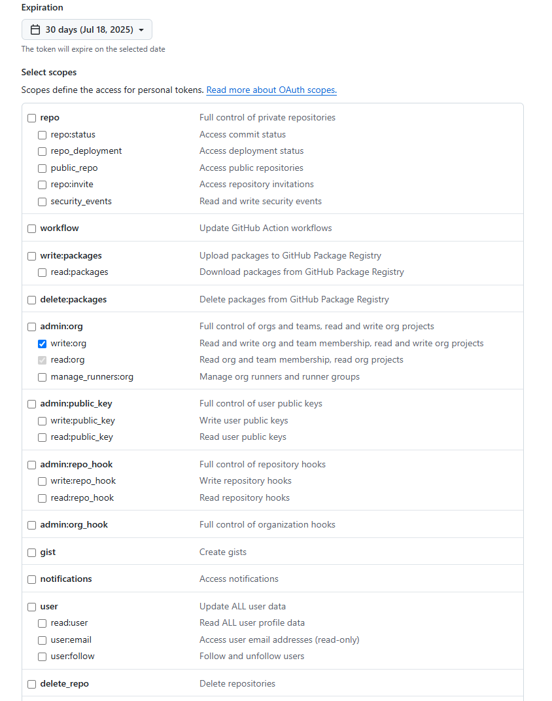

- Now user will get the token which he/she have to use to log in into central vault. And then he/she have to go to central vault url.

## Login to central vault

- URL for central vault: [Central Vault](https://vault.c-27d7c36.kyma.ondemand.com/)

  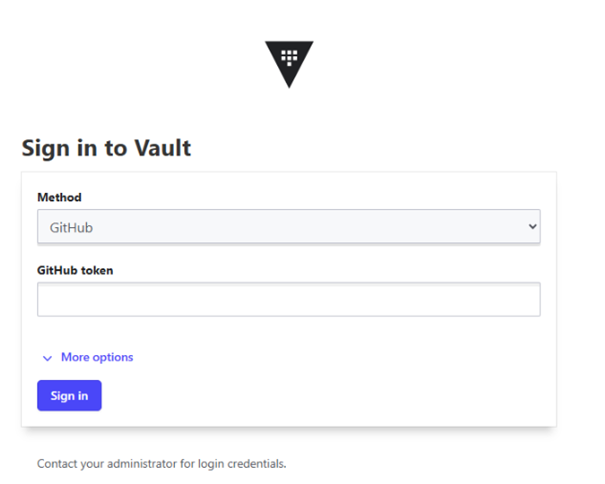

## See your secrets in central vault

- After logging in to the central vault, the user will be able to see the following

  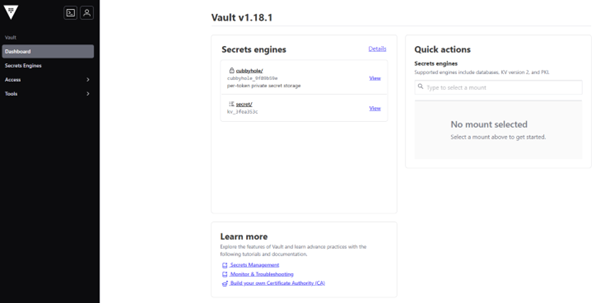

- Then user have to click on secret/ and then he/she can able to see this:

  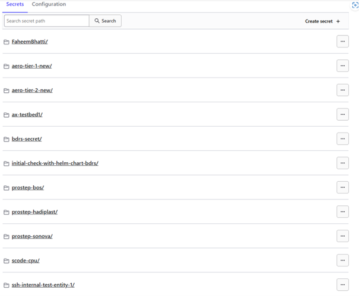

- From here user can only able to see his/her assigned folder. If he/she will open any other folder then he/she will able to see

  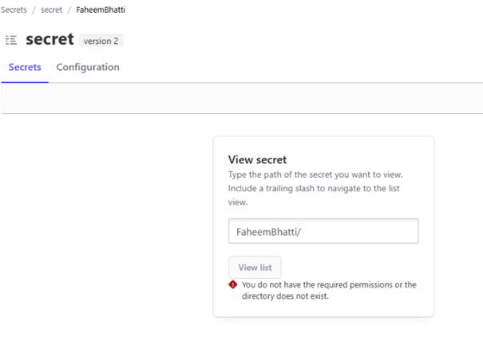

- When user will click on his/her folder then he/she can able to see:

  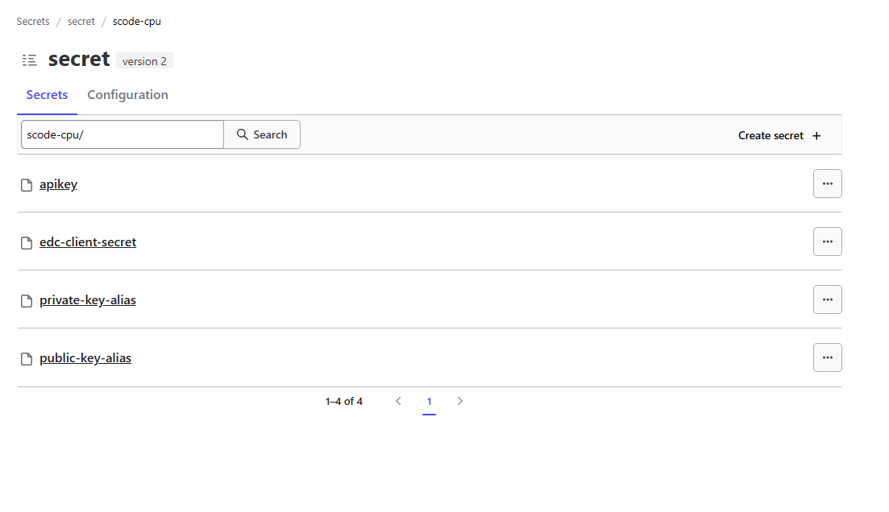

- Then from here he/she can see any secrets. Example for apikey:

  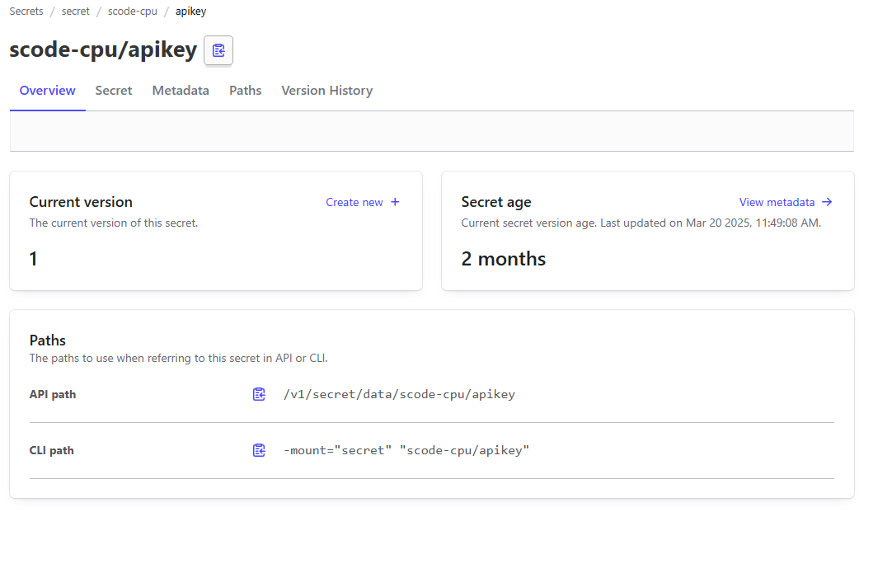

- Then he/she have to click on Secret and then he/she can able to see:

  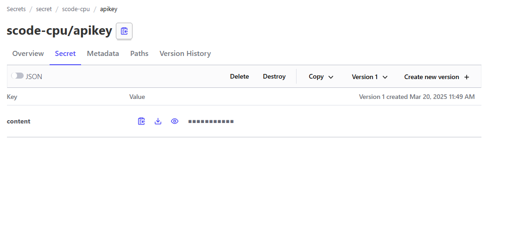

- From here he/she have to click on eye icon then he/she can able to see secrets

## Add secret to central vault

- User can add his/her secret inside his/her assigned folder

- To add secret user have to click on Create secret:

  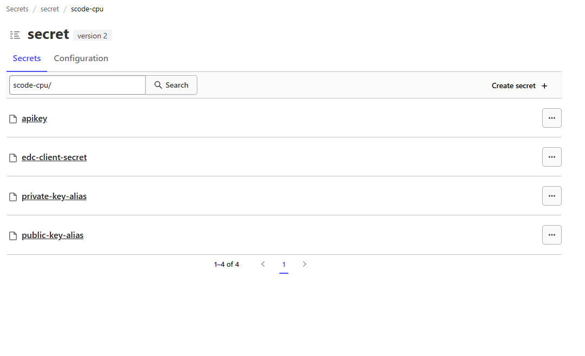

- Then user can able to see this:

  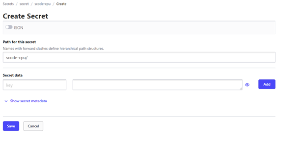

- Here user have to write his/her secret name and then Secret data with key and value. And then user have to click on save button.

- User can also turn on JSON-button to create the secret:

  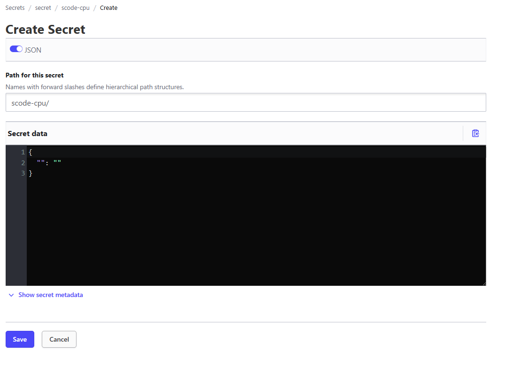
